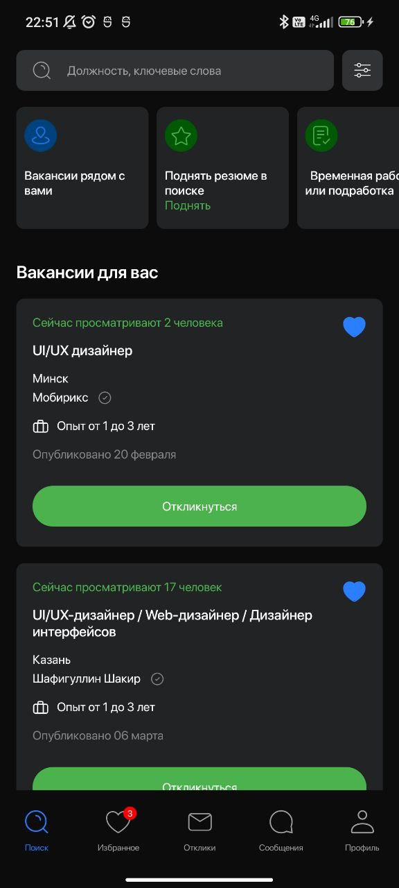
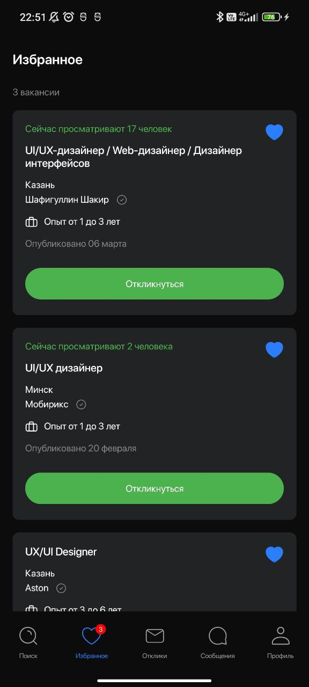

# JobSearch
The job search app was developed as a test assignment for an Effective Mobile company

## Requirements

- **Minimum Android Version**: 8.0 (Oreo)

## 🛠️ Tech stack

- MVVM
- Modularization & Multi Module App Architecture
- Clean Architecture
- Jetpack Compose
- Ktor Client
- Coroutines
- Flow
- Dagger
- Hilt
- SOLID
- Shimmer
- Centralize Dependencies ( With Version Catalogs )
- Lint
- Room
- Kotlinx Serialization
- Material3
- Coil

## 📸 Screenshots

<table>
  <tr>
    <td></td>
    <td></td>
  <tr>
</table>
